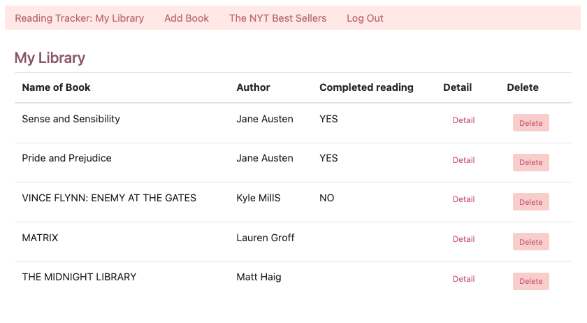
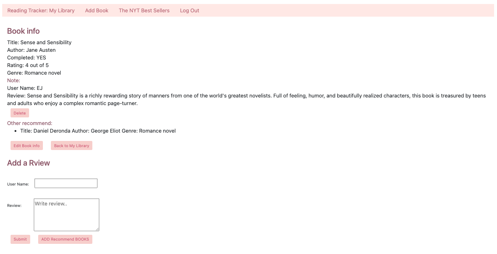
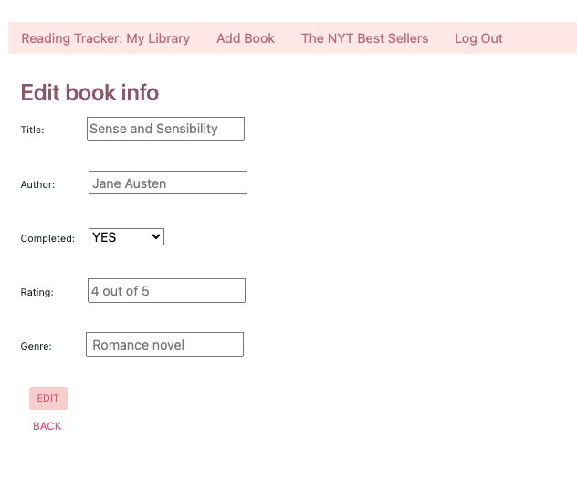
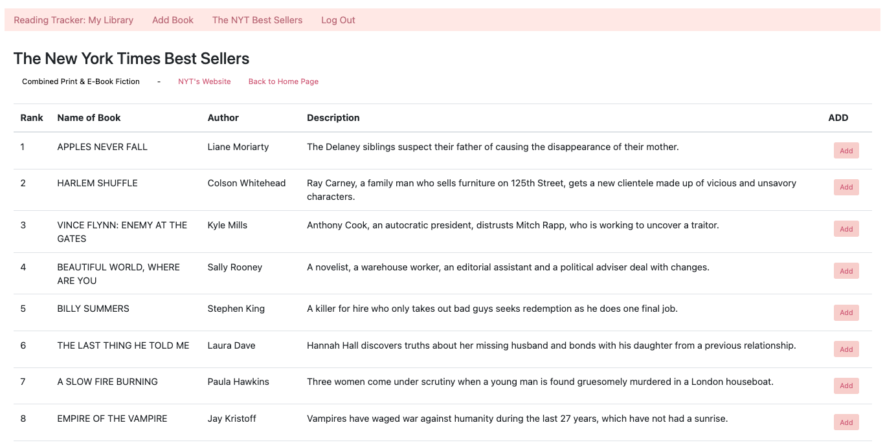
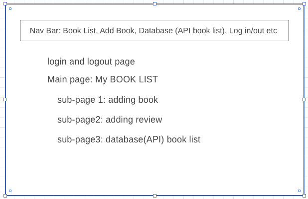
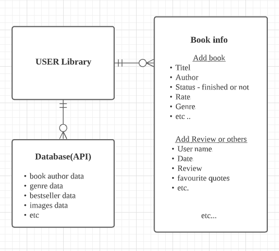

# App Title: My Book Lounge (heroku: https://ej-reading-tracker.herokuapp.com/books)

- (former named)Book Tracker
- This app is like a reading journal that you can store your reading record/or book information etc.
- You can add books that you've read or books you want to read later.
- You can also write the review of book.
- The New York Times bestseller provided that can be added to your future reading list.
- You can also add other recommended books or books of similar genres.

# Screenshot(s):

# Technologies Used:

Node.js, Express, MongoDB, Google Oauth2, Bootstrap, API,HTML, CSS, JavaScript, Heroku

# Getting Started:

- As a user, add a book information
- As a user, I want to edit the book information
- As a user, I want to delete book information
- As a user, I want to read/add another books (recommended books)
- As a user, I want to add recommend books

# Next Steps: Planned future enhancements

- Add more functions
- Find some API(book-images)
- Work on styles(CSS)
